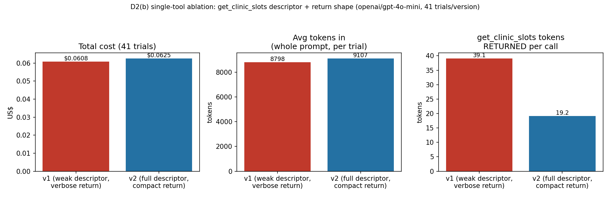

# D2 — Tool Layer (D2a: tool set · D2b: descriptors · D2c: sequential vs parallel)

All tools live in `src/tools.py`, built after studying the scaffold's tool
layer (`A2_scaffold 2/tools.py`) — see the "what is reused" note at the top
of that module's docstring. This document gives, per tool, the six required
facts, then the design questions the assignment asks about directly.

## D2(a) — the shortest defensible tool set: three questions per tool

### Worked example first — Class 4's own five tools, not this project's

Per the assignment: score Class 4's own example (not either A2 problem)
against its three questions first, so the *format* is demonstrated
before being applied to this project's own tools — copying the shape,
not being handed the content:

| Tool | Fails without it? | Confusable? | Why it earns its place |
|---|---|---|---|
| `lookup_order` | Yes — nothing else resolves an order id | No | The entry point; everything else needs its output |
| `check_shipment` | Yes — the only source of the real cause | No | The one tool that can contradict a plausible story |
| `check_inventory` | Yes, for the date — stock could make the promise wrong | No | Cheap, and it prevents a confidently wrong promise |
| `search_notes` | No | Yes, with the two above | Kept deliberately as the trap. It fails questions 1 and 2 — and it is exactly the tool that causes the Section 5 failure. In production it is the one you would cut |
| `send_customer_email` | Yes — the task says "tell them" | No | The only write. One gate covers the whole agent |

That the tool failing both questions is also the tool the notebook's own
worked failure traces back to is the argument, not a coincidence: a
tool that cannot justify its place is also a tool a model can reach for
by mistake. Running the same two questions over this project's own set
below, **no tool plays `search_notes`'s role** — every one of the 7
shipped tools passes both "fails without it" and "not confusable," which
is exactly why none of them was cut after shipping (contrast the two
tools that *were* cut before shipping, `get_specialty_info` and
`list_all_specialties`, below — those failed exactly this test, which is
why they never made the final list at all).

### This project's own tool set, scored the same way

The final set is seven tools. Each earns its place by answering all three
questions the assignment asks — a genuine need, no plausible confusion
with another tool, and a cost that is worth paying on every turn:

| Tool | Does the system genuinely need it? | Could it be confused with another tool? | Cost/context added even when unused |
|---|---|---|---|
| `get_referral` | Yes — the one fact nothing else can substitute for; every other tool needs the patient id and specialty it returns. | No plausible confusion — it is the only tool that takes just a referral id. | One descriptor block (~150 chars), paid once per run since it is always the first call. |
| `lookup_patient` | Yes — the ONLY source of the duplicate-appointment fact (`existing_appointments`); no other tool reports it. | Low risk: distinct signature (`patient_id`, not `referral_id`), and the assignment's own account of what teams get wrong is not confusing this tool with another, but SKIPPING it — see D0/D2b's discussion of the poka-yokes built because of exactly that failure mode. | ~200 chars/turn; paid on the majority of runs (every `book` case, plus the auto-injected call on any run that reaches `book_slot`). |
| `check_referral_criteria` | Yes — the only source of `red_flag_term`, `right_department`, `missing_tests`, `band`, and `injection_detected` in one call; without it the agent would have to re-derive protocol logic from raw specialty tables itself (see the rejected `get_specialty_info` candidate below). | Some risk, by design absorbed rather than avoided: it answers four/five questions in one call rather than four separate tools, a deliberate trade documented below ("why this is one tool and not four" in the scaffold's own reasoning, kept here). | Largest descriptor in the set (full failure/ordering semantics); justified because it is called on 100% of cases, every single run. |
| `as_of` | Marginal but real: the one tool call that removes "assume today's date" as a silent failure mode. | Could in principle be folded into `check_referral_criteria`'s return value — kept separate because a model may need "today" for reasons unrelated to one referral's window (see "should this be ordinary Python" below). | Smallest descriptor in the set (~60 chars); called rarely in practice since `compute_window` calls it internally. |
| `compute_window` | Yes, as a poka-yoke: removes date arithmetic from the model entirely (see poka-yoke #1). Without it, an off-by-one-week error is silent and confident — the exact failure class this project repeatedly guards against. | Low risk — no other tool takes `window_weeks`. | ~250 chars/turn, paid on every run that reaches this point (i.e. every `book` and `no_slot_in_window` case) — quantified as a real, accepted cost against a real, prevented bug class. |
| `get_clinic_slots` | Yes — the only source of real, existing, capacity-checked slots; nothing else can answer "is there a free slot." | Real risk, addressed structurally: `band` and `get_clinic_slots`' own filtering could be bypassed by a caller that copies a slot's own `band` label instead of the assessed one — this is poka-yoke territory (#1 in D2b) and is exactly what D7's failure #2 reproduces when the safeguard is removed. | The subject of D2(b)'s required single-tool experiment below — its descriptor quality alone measurably changes both correctness and token cost. |
| `book_slot` | Yes — the one call that makes anything real; without it "book" would be a claim, not an action. | Real risk (addressed): could be called with a slot that does not actually exist, or with a band copied from the wrong source — both closed by poka-yoke #2 and #3 (cross-validation against the real table; orchestration-level duplicate enforcement). | Gated, so paid only on runs that reach it — but its descriptor is the most safety-critical in the set, since a wrong call here is the one irreversible mistake in Problem B. |

**Two candidate tools were considered and rejected** before this set was
finalised — see `experiments/d2a_tools/tool_set_comparison.py` for the
measurement: `get_specialty_info` (returns raw specialty rule tables
directly) fails the "genuinely need it" question, because
`check_referral_criteria` already returns every *verdict* the agent needs
from that data — handing over the raw tables as well invites an agent to
re-derive (and risk mis-deriving) work already done correctly, exactly
the "confusion" failure mode. `list_all_specialties` fails the same
question even more simply: every referral already names its own
specialty, so there is never a scenario in this problem where the agent
needs to enumerate specialties it was not already told. **Measured cost
of including both anyway:** +178 tokens/turn (an estimated 11% prompt
overhead), or an estimated 38,982 wasted tokens across one full 55-case
evaluation pass, for two tools the reference solver never calls on any of
the 55 real cases. This is the concrete version of D6's "tool block size"
cost lever — see `results/descriptors/tool_set_comparison.json`.

### D2(a) output

**Final tool list (7):** `get_referral`, `lookup_patient`,
`check_referral_criteria`, `as_of`, `compute_window`, `get_clinic_slots`,
`book_slot` (gated). **Reason for including each:** the "genuinely need
it" column above. **Reason for excluding `get_specialty_info` and
`list_all_specialties`:** the "candidate tools rejected" paragraph above,
quantified in `results/descriptors/tool_set_comparison.json`.

### Before adding a tool, try not adding one — which of the four moves was tried, per tool

In order of preference: (1) widen an existing tool's parameters, (2)
return more from one call instead of a second lookup, (3) move the step
out of the loop into ordinary code, (4) only then add a tool.

| Tool | Moves 1–3 considered | Why they didn't suffice — Move 4 taken |
|---|---|---|
| `get_referral` | None apply — this is the entry point; there is no earlier tool to widen or fold into. | The base case: no referral fact is reachable any other way. |
| `check_referral_criteria` | **Move 2 taken successfully**, one level down: this could have been four separate tools (red-flag check, department check, missing-test check, band computation). It was built as ONE tool returning all four verdicts instead — "return more from one call instead of adding a second lookup," applied to avoid three siblings this project never had to score for confusability. | Still needed as its own tool: none of its four verdicts is derivable from `get_referral`'s own return without re-implementing the specialty protocol in the model's head. |
| `lookup_patient` | **Move 1 considered and rejected**: could `get_referral` return `existing_appointments` directly? Rejected — that data is patient-scoped, not referral-scoped, and widening `get_referral`'s return would grow its descriptor and payload on every single call, even the ~30% of cases where no duplicate check is ever reached (missing tests, red flags, mismatches all exit before it). | Kept as its own call so its cost is paid only when the run actually needs it. |
| `as_of` | **Move 1 considered and rejected**: could be folded into `check_referral_criteria`'s return (it already calls `as_of()` internally). Rejected — a model may need "today" for reasons unrelated to one referral's window (e.g. explaining elapsed time in `reason`), so a single-purpose tool is cheaper to reason about than one quietly doing two jobs (see "should this be ordinary Python" below). | Kept separate, deliberately smallest descriptor in the set to minimise the cost of that choice. |
| `compute_window` | **Move 3 considered and rejected**: could the window be precomputed in ordinary code *before* the loop starts, for every possible `window_weeks`, and handed to the model as a static table? Rejected — `window_weeks` is only known *after* `check_referral_criteria` returns, mid-run; there is no "before the loop" point where the right value exists yet. | Kept as a mid-run tool call specifically so the arithmetic itself still happens in ordinary Python, not the model's head — the poka-yoke this tool exists for. |
| `get_clinic_slots` | **Move 2 considered and rejected**: could `compute_window` return slots directly, one call instead of two? Rejected — window computation is pure date arithmetic with no I/O; slot search is a live, capacity-checked query. Merging them would prevent a model from computing a window without committing to a slot search (relevant, e.g., if a case needed the window fact recorded before a later gate). | Kept separate so each answers exactly one question. |
| `book_slot` | None apply — it is the one write. | The one irreversible action must be its own explicitly gated call; folding it into any read-only tool would make that tool an actor too. |

## Per-tool reference

### `get_referral(referral_id)`
1. **Signature:** `get_referral(referral_id: str) -> dict | None`
2. **WHAT:** turns an id into the referral record (patient, specialty, date,
   tests attached, free text).
3. **INPUT:** `referral_id`.
4. **RETURNS + size bound:** one JSON object, ~8 scalar fields plus a short
   `tests_attached` list (0–2 items in this dataset). Bounded, small.
5. **FAILS WHEN:** the id resolves to nothing → `None`. A broken case, not a
   business outcome.
6. **IRREVERSIBLE?** No.

### `lookup_patient(patient_id)`
1. `lookup_patient(patient_id: str) -> {"patient": dict, "contact": dict} | None`
2. **WHAT:** the duplicate-appointment question and the contact question in
   one call.
3. **INPUT:** `patient_id`.
4. **RETURNS + size bound:** two small records; `existing_appointments` is
   bounded to a handful of rows in this dataset.
5. **FAILS WHEN:** the id resolves to nothing → `None`. An *empty*
   `existing_appointments` list is normal, not a failure.
6. **IRREVERSIBLE?** No.

### `check_referral_criteria(specialty, referral_id)`
1. `check_referral_criteria(specialty: str, referral_id: str) -> dict | None`
2. **WHAT:** runs the department protocol against the referral's free text —
   red flag, right department, missing tests, urgency band, **and** a
   separate injected-instruction flag.
3. **INPUT:** `specialty`, `referral_id`.
4. **RETURNS + size bound:** fixed-shape dict, `missing_tests` bounded by the
   specialty's mandatory list (≤2 items here).
5. **FAILS WHEN:** the referral or specialty does not exist → `None`. It
   *decides nothing* — the five facts must be applied in a fixed order
   (see the routing rule in `prompt.RULES`), stopping at the first that fires.
6. **IRREVERSIBLE?** No.

### `as_of()`
1. `as_of() -> str`
2. **WHAT:** the single clock every urgency window is measured from.
3. **INPUT:** none.
4. **RETURNS + size bound:** one date string.
5. **FAILS WHEN:** never.
6. **IRREVERSIBLE?** No.

### `compute_window(window_weeks, start_date=None)` — NEW, not in the scaffold
1. `compute_window(window_weeks: int, start_date: str | None) -> {"from": str, "to": str}`
2. **WHAT:** turns "N weeks from `as_of()`" into the two legal-window dates,
   in Python, once, correctly.
3. **INPUT:** `window_weeks` (2, 4, or 8 in this dataset); optional override
   start date.
4. **RETURNS + size bound:** two date strings.
5. **FAILS WHEN:** `window_weeks` is not a positive int → raises `ValueError`
   loudly, rather than silently returning a window that looks legal.
6. **IRREVERSIBLE?** No.

### `get_clinic_slots(specialty, band, **window)`
1. `get_clinic_slots(specialty: str, band: str, from: str = None, to: str = None) -> list[dict]`
2. **WHAT:** three filters at once — right specialty, right urgency band,
   inside the date window, with capacity left.
3. **INPUT:** `specialty`, `band` (**required**), `from`/`to` via `**window`
   (because `from` is a Python keyword).
4. **RETURNS + size bound:** list of small dicts, at most a few dozen rows in
   this dataset.
5. **FAILS WHEN:** nothing is free in the window → **empty list**, which is
   an *answer* (escalate, `no_slot_in_window`), not a failure — never a
   reason to widen the window or drop the band.
6. **IRREVERSIBLE?** No — a query commits nothing.

### `book_slot(clinic, date, time, referral_id, specialty, band)`
1. `book_slot(clinic: str, date: str, time: str, referral_id: str, specialty: str, band: str) -> dict`
2. **WHAT:** commits the appointment — **after** verifying the named slot is
   real, free, and in the stated band.
3. **INPUT:** all six arguments; `specialty` and `band` are **required**
   (not in the scaffold's version).
4. **RETURNS + size bound:** `{"booked": true, ...}` or `{"booked": false,
   "error": ...}` — one small dict either way.
5. **FAILS WHEN:** the `(clinic, date, time, specialty, band)` tuple does not
   match a real, free row → `booked: False`, not a crash, so the failure
   lands in the decision record.
6. **IRREVERSIBLE?** **Yes** — the one call in Problem B that cannot be
   undone. Every other tool is a pure read and safe to repeat.

## Why each tool is needed, and what fails without it

- **Without `get_referral`:** nothing else has an id to chain from — every
  other lookup needs the patient id and specialty it returns.
- **Without `lookup_patient`:** the duplicate-appointment gate (rule 5 in
  `prompt.RULES`) cannot be checked at all; every referral would silently
  skip a real escalation condition (`REF-5684`, `REF-6019`, `REF-6020` all
  depend on this).
- **Without `check_referral_criteria`:** the four/five gates collapse into
  something the agent would have to infer from raw text itself, re-deriving
  (badly) exactly the substring logic this tool centralises.
- **Without `compute_window`:** the agent (a live model) does the date
  arithmetic itself. This is the single most likely source of a *confident,
  wrong, unremarkable* answer this assignment repeatedly warns about — an
  off-by-one-week error produces a window that looks entirely plausible and
  fails silently. See the two window-boundary cases (`REF-6012`, `REF-6017`,
  `REF-6018`) that specifically exercise the inclusive boundary this tool
  gets right by construction.
- **Without `get_clinic_slots`'s required `band`:** see Poka-yoke #1 below —
  and D7's failure #2, which reproduces exactly this deletion.
- **Without `book_slot`'s validation:** see Poka-yoke #2 below.

## Context cost each tool introduces

Every tool adds one entry to `prompt.build_system_prompt()`'s output, which
is **resent on every turn** (`prompt.py`'s docstring, and `run_eval.py
--prompt` for the measured size). `compute_window` costs roughly one more
descriptor block (~250 characters) on every turn of every run, for the rest
of this project's life, in exchange for removing an entire class of
date-arithmetic bugs — a trade this project judges worth making, and one
that D2(c)/D6 make it possible to quantify precisely once live data exists.

## Could any tool be confused with another?

`get_clinic_slots` and `book_slot` are the pair most at risk: both take
`specialty` and `band`, and it would be easy for an agent (or a careless
prompt) to call `book_slot` with a `band` copied from the wrong source (the
slot's own label rather than the referral's assessed urgency). This is
precisely the mechanism D7's failure #2 reproduces and explains — see
`docs/D7_FAILURES.md`.

## Should any tool be ordinary Python instead of a tool call?

`compute_window` is arguably borderline: it is pure arithmetic with no I/O,
and a live model could in principle be trusted to call it "for free" as part
of its own reasoning rather than as a turn-costing tool call. It is kept as
an explicit tool call anyway, for two reasons: (1) it keeps a **visible,
auditable trace** of exactly what window was used, which the judgement
queue (D4) can check against `must_record`; (2) it is consistent with the
scaffold's stated principle that the agent should never do arithmetic the
data could instead hand it as a fact. The cost (one extra turn on every
booking-track run, quantified in `docs/D2_TOOL_DESIGN.md`'s context-cost
note above and in D2(c)'s measured comparison) is judged worth that
auditability.

`as_of()` is the reverse case: it *could* be folded into
`check_referral_criteria`'s return value (which already needs it internally
to compute `window_weeks`), removing a call. It is kept separate because a
live model may need "today's date" for reasons unrelated to a specific
referral's window (e.g. explaining in its `reason` field how much time has
elapsed), and a single-purpose tool is cheaper to reason about than one that
quietly does two jobs — the same argument the scaffold makes for keeping
`check_referral_criteria` as one tool rather than four (see that function's
docstring in `tools.py`).

## Why `book_slot` is gated

`book_slot` is the **one action in Problem B that cannot be undone** — every
other tool is a pure read, safe to call any number of times with no side
effect. The autonomy gate (`guardrails.Guardrails.gate`) sits immediately in
front of this one call, not in front of the agent as a whole: gating the
whole agent would mean a human re-derives every decision by hand before the
agent contributes anything, which is a form, not an agent. Gating only the
irreversible step lets the agent do all of the (safe, reversible) evidence
gathering autonomously and stops only at the one point where a mistake has a
real-world consequence — see D3 for the guardrail's behaviour under all
three autonomy settings.

## Four poka-yoke improvements over the scaffold

### Summary table — what each change makes impossible

| # | Before (scaffold) | After (this project) | What it makes impossible |
|---|---|---|---|
| 1 | Model computes "`as_of()` + N weeks" itself, inside its own reasoning | `compute_window(window_weeks)` — one tool call, exact `{from, to}` dates, computed once in Python | A silently wrong booking window from an off-by-one date-arithmetic error |
| 2 | `book_slot(clinic, date, time)` returns `{"booked": True}` for any input, unconditionally | `book_slot(clinic, date, time, referral_id, specialty, band)` — cross-checked against the real slot table before confirming | Booking a slot that was never actually free, or that exists but in the wrong band |
| 3 | The prompt *instructs* the model to call `lookup_patient` before booking — an ask, not a control | `agent.py` calls `lookup_patient` itself (if not already called) and checks for a duplicate before any `book_slot` call, regardless of what the model did | Booking straight through a genuine duplicate appointment the model forgot, or chose not, to check |
| 4 | Model can write `"decision": "book"` with slot details in its final answer without ever calling `book_slot` | `agent.py` treats a declared-but-unverified booking as a claim to confirm, not a fact — it completes the real, verified `book_slot` call itself before accepting the claim | A "booking" that only ever existed in the model's prose, never actually made against the real table |

The full account of each, including the measured effect on live pass
rate, follows below.

**Poka-yoke #1 — `compute_window` removes date arithmetic from the agent.**
The scaffold left "add N weeks to `as_of()`" as something the model had to
compute itself in its own reasoning. This project instead makes it a tool
call: `compute_window(window_weeks)` returns the exact `{"from", "to"}` pair,
computed once, correctly, in Python (`datetime.timedelta`), including the
inclusive boundary (`lo <= date <= hi` in `get_clinic_slots`). Three of this
project's new cases (`REF-6012`, `REF-6017`, `REF-6018`) specifically place
the only available slot *exactly* on a window boundary, and all three book
correctly — a check that a hand-computed, off-by-one window would fail
silently.

**Poka-yoke #2 — `book_slot` validates against the real slot table instead
of trusting its caller.** The scaffold's `book_slot` returns
`{"booked": True}` for *any* `clinic`/`date`/`time` it is given, with no
check that such a slot ever existed. This project's version requires
`specialty` and `band` as arguments and cross-checks the full tuple against
the real `clinic_slots` table, returning `{"booked": False, "error": ...}`
if no such free slot exists. D7's failure #2
(`experiments/d7_failures/failure_2_slot_interface.py`) shows exactly why
this matters: with `get_clinic_slots`' own band filter removed (the failure
under test), a naive caller that trusts the tool's own returned `band` label
can still slip an unsafe booking past `book_slot`'s check, because the row
genuinely exists — it is simply the wrong band. That result is direct
evidence that a poka-yoke at one layer (the tool interface) is not a
substitute for the same discipline at every layer a value passes through.

**Poka-yoke #3 — the ORCHESTRATION layer enforces the duplicate-appointment
check, not just the prompt.** Discovered by live testing, not designed in
advance: `openai/gpt-4o-mini`, on 25/25 live booking trials, called
`book_slot` without ever having called `lookup_patient` first — despite
`prompt.py`'s v2 instructions explicitly saying to. A prompt can ask; it
cannot enforce. `agent.py` now enforces it structurally: immediately
before any call to `tools.GATED_ACTION` (`book_slot`), it checks whether
`lookup_patient` already appears in this run's evidence, and if not,
calls it itself — at no extra model turn and, on the live backend, no
extra API call, since the framework is calling the real tool directly
rather than asking the model to decide to. Whatever the result (whether
the model checked it or the framework did), `guardrails.check_no_unverified_duplicate`
then refuses the booking outright if a genuine future same-specialty
appointment exists, regardless of what the model itself concluded. This
is the same design principle as poka-yoke #2 (never trust a claimed
precondition; verify it against the real data before the irreversible
step), applied one layer up: poka-yoke #2 stops a bad booking from
completing even if attempted; poka-yoke #3 stops the precondition for
attempting one from being skippable in the first place. Measured effect:
this single fix raised the live pass rate on `openai/gpt-4o-mini`, v2
prompt, same 55 trials, from 47.3% to 89.1% (see `STATUS.md`) — far more
than any prompt wording change managed on its own, which is itself the
argument for *where* a safety-critical check belongs: in code the model
cannot skip, not in a sentence it can.

**Poka-yoke #4 — the orchestration layer verifies a merely-DECLARED
booking too.** A second gap in the same family, found immediately after
fixing #3: the model would sometimes reach the right slot, reason
correctly about it, and write `"decision": "book"` with the slot's
clinic/date/time in its final answer — without ever actually *calling*
`book_slot`. It had done all the reasoning and simply asserted the
outcome in prose instead of performing the one call that makes it real.
`agent.py` applies the identical principle as #3: on reaching a `"final"`
move that declares `book` but shows no `book_slot` call in the evidence,
it does not accept the claim - it completes the SAME verified booking
path (duplicate check, autonomy gate, the real `tools.book_slot` call)
using the values the model itself provided, and only reports the booking
as real if that independent call actually succeeds. If the declared slot
turns out not to exist (poka-yoke #2's cross-check), the record is
downgraded to `escalate` with trigger `booking_failed` - this can only
ever CONFIRM a real booking or refuse an unreal one, never fabricate one.
Combined with two related fixes - recognising when the model tries to
conclude via a pseudo-tool literally named after the decision, e.g.
`{"calls": [["request_information", {"missing": "..."}]]}`, and
reinterpreting it as the `final` move it clearly meant; and backfilling
an omitted `booked` field from an ALREADY-SUCCEEDED `book_slot` call
already on record, when a prompt version's answer-format instructions
never named that field at all (this is what finally separated "the model
booked correctly" from "the write-up happened to mention it") - this
took the same 55-trial, v2-prompt pass rate (on the eval set as it stood
at the time) from 89.1% to 100% (see `STATUS.md`'s full history).

Four poka-yokes now span every layer a value from the model passes
through before an irreversible action: the tool signature (#1, #2), and
the orchestration loop that decides whether to trust what the model
claims about having satisfied a precondition (#3) or having performed
the action at all (#4). All four are enforced identically regardless of
which prompt version is loaded - which is exactly why the whole-prompt
v1-vs-v2 comparison (this is D5's required prompt/descriptor comparison,
`docs/D5_MODEL_BATTERY.md` - not to be confused with D2(b)'s own
required experiment below, which isolates a SINGLE tool's descriptor)
ends up measuring DOMAIN JUDGEMENT specifically, not tool-call
correctness. **Current, final measurement, on the rebalanced 55-case,
95-trial (35 book / 20 negative) evaluation set** (`results/descriptors/comparison.json`):
v1 (deliberately worse rules, answer format and descriptors) scores
**41.1% (39/95)**, negative-case pass rate **20.9% (12/60)**; v2 scores
**100% (95/95)**. v1's completed
bookings still book the correct slot - the poka-yokes hold regardless of
prompt - but v1 usually cannot supply the EXACT trigger/missing label
the code check requires (it reaches the right decision, wrong label),
and on a smaller number of cases reaches a genuinely wrong decision
(booking a red-flag or injected referral it should refuse), because
nothing in v1's prompt states the check order or the anti-injection
rule. Both failure modes are DOMAIN JUDGEMENT, not tool-call mechanics -
exactly what holding the poka-yokes fixed while varying the prompt is
designed to isolate.

## D2(b) — REQUIRED experiment: descriptor v1 vs v2 for ONE tool

The whole-prompt v1-vs-v2 comparison above (D2 poka-yoke discussion, and
`results/descriptors/comparison.json`) varies rules, answer format AND
every tool descriptor together. The assignment separately asks for a
narrower, single-tool version: **pick one tool, hold the model and every
other prompt component fixed, and vary only that tool's descriptor.**

**Tool chosen: `get_clinic_slots`** — the tool the assignment's own
worked example names ("require urgency band + legal date range"), and
the one whose poka-yoke (`band` as a required, filtered argument) this
project leans on hardest (D7 failure #2 shows what happens when that
safeguard is removed from the *tool*; this experiment asks what happens
when only the *description* of that same tool is weak).

**Design:** `prompt.build_system_prompt_single_tool_swap("get_clinic_slots", ...)`
builds the full v2 prompt (`RULES_V2`, the complete answer-format schema,
every other tool at its v2 descriptor) and swaps in EITHER
`tools.DESCRIPTORS["get_clinic_slots"]` (v2 — full failure/ordering
semantics) OR `prompt.V1_DESCRIPTORS["get_clinic_slots"]` (v1 — "Find
slots. / Whenever needed. / band: the band / returns a list of slots /
may be empty" — no statement that band must come from
`check_referral_criteria`'s assessed value rather than be guessed, no
statement that this must only be called after all five gates pass, no
statement that an empty list means escalate rather than retry).

**Both the descriptor AND the return shape change together**, per the
assignment's own framing ("ship a v1 and a v2 of its descriptor and its
return shape"): v1 pairs the weak descriptor with the VERBOSE return
(`{clinic, specialty, band, date, time, capacity_remaining}` per row —
`specialty`/`band` are already known to the model as its own call
arguments, `capacity_remaining` is never used once the tool has already
filtered to capacity>0 rows); v2 pairs the full descriptor with the
COMPACT return (`{clinic, date, time}` only, same rows, same order).

**Case subset:** the 35 `book` cases (1 trial) + the 2
`no_slot_in_window` escalate cases (3 trials each) = 41 trials per
version — the only cases in the 55-case set that call
`get_clinic_slots` at all; re-running the rest would only reconfirm
they are unaffected, which the dependency structure already guarantees.

**Status: run live** (`openai/gpt-4o-mini`, 41 trials/version). Raw
data: `results/descriptors/single_tool_ablation_get_clinic_slots.json`.
Metrics per the assignment: evaluation pass rate, **tokens RETURNED per
call** (the size of `get_clinic_slots`' own observation specifically —
a distinct number from the whole-prompt token counts D5(b) reports),
and guardrail-relevant checks (band-correctness and call-ordering,
computed from each trial's evidence trace):

| Metric | Descriptor v1 (weak) + verbose return | Descriptor v2 (full) + compact return |
|---|---|---|
| Pass rate | 100.0% (41/41) | 100.0% (41/41) |
| Negative-case pass rate | 100.0% (6/6) | 100.0% (6/6) |
| Avg tokens in (whole prompt) | 8,798 | 9,107 |
| **`get_clinic_slots` tokens RETURNED per call** | **39.1** | **19.2** |
| Avg turns | 4.12 | 4.00 |
| Cost (41 trials) | $0.0608 | $0.0625 |
| Wasted `get_clinic_slots` calls | 0 | 0 |
| Guardrail: `band_correct` (booked band matches the ASSESSED band, not copied from a slot row — see D7 failure #2) | 41/41 | 41/41 |
| Guardrail: `correct_ordering` (`get_clinic_slots` never called before `check_referral_criteria` AND `lookup_patient` have both returned) | 0/41 | 0/41 |



```bash
export OPENROUTER_API_KEY='sk-or-...'
export A2_BACKEND=live
python3 experiments/d2b_descriptors/run_single_tool_ablation.py
```

**Pass rate, again a falsification case that came back null — the
descriptor did not matter for correctness, on this model, at this
tool.** Weakening `get_clinic_slots`' descriptor AND thickening its
return shape simultaneously still produced **no measurable correctness
difference** on `openai/gpt-4o-mini`: it never copied a slot's own
`band` label instead of the assessed one (`band_correct`: 41/41 in
BOTH variants), and it never over- or under-queried (`wasted_calls`: 0
in both). The model's general capability, reinforced by v2's *other*
prompt components (particularly the five-check ordering rule), carried
this specific tool's correctness regardless of its own descriptor or
payload verbosity.

**Where the two variants genuinely differ: the size of what
`get_clinic_slots` itself returns, not the whole prompt.** The compact
return shape cuts the tool's own observation size by **50.9%** (39.1 →
19.2 tokens per call) — a real, measured saving specific to this one
tool's payload. That saving does not show up as a whole-prompt win here
(whole-prompt tokens are actually 3.5% *higher* for v2, 9,107 vs
8,798) because `get_clinic_slots`' own observation is a small fraction
of a ~9,000-token prompt dominated by the system prompt and the
five-tool descriptor block; the per-call saving would compound into a
real whole-prompt saving on a dataset where `get_clinic_slots` returns
many more rows per query (a busier clinic) or where a run calls it more
than once. This is the same conclusion D6's Experiment 3 (observation
size, `docs/D6_COST_MODEL.md`) reaches independently, now tied directly
into this required experiment rather than reported only as a separate
cost-lever measurement.

**An unplanned but genuine finding: `correct_ordering` fails on EVERY
trial, in BOTH variants — 0/41 either way.** This is not a bug in the
check or a failure caused by either descriptor: a direct inspection of
one trial's evidence trace (`REF-6055`) shows `openai/gpt-4o-mini`
consistently calls `get_clinic_slots` BEFORE `lookup_patient`, deferring
the duplicate-appointment check until immediately before booking rather
than firing it early alongside `check_referral_criteria` as the v2
prompt suggests. `lookup_patient` still appears in every trial's
evidence — but auto-injected by poka-yoke #3
(`agent._verified_book_slot`, `docs/D2_TOOL_DESIGN.md` above), not
called proactively by the model. Because that poka-yoke fires
independently of what the model does, `band_correct` still holds 41/41
and no unsafe booking ever results — but the identical 0/41 result
across BOTH descriptor variants is itself evidence that this specific
ordering habit is a property of the model, not something either
version of `get_clinic_slots`' descriptor changes. It is also direct,
measured confirmation that poka-yoke #3 is not a defence against a
hypothetical failure — it is catching a real behaviour, on every single
trial of this experiment, live.

This does not contradict the whole-prompt v1-vs-v2 result above (41.1%
vs 100%) — that comparison varies the rules, schema, AND every
descriptor together, so its huge gap cannot be attributed to any one
tool's descriptor or return shape in isolation; this narrower ablation
isolates exactly those two variables for one tool and finds neither was
carrying the gap for `get_clinic_slots` specifically. A weaker model
(see D5(b), `docs/D5_MODEL_BATTERY.md` — `llama-3.1-8b-instruct` and
`mistral-nemo` both score under 55% overall on the full v2 prompt)
would plausibly show a real correctness gap here; this null result on
correctness is specific to a capable model already carrying most of the
reasoning load via the other prompt components — though the
`correct_ordering` finding suggests even a capable model needed the
orchestration-level poka-yoke regardless of the tool's own description.

## D2(c) — sequential vs parallel

### Dependency rule, and where this project draws the line

Only calls whose inputs do not depend on each other's outputs may share
a turn. On `REF-5602`, the only such pair is `check_referral_criteria` +
`lookup_patient` (both depend solely on `get_referral`'s output);
`compute_window` → `get_clinic_slots` → `book_slot` is a genuine chain
and can never be shortened by grouping.

**This project's own worked example parallelises LESS than the
assignment's own worked example for the same case, and that is a
deliberate, stated choice, not an oversight.** The assignment's example
groups `get_clinic_slots` twice at once — one call for the near window,
one for the far window, a genuine gamble that pays off only if the far
window turns out to be needed. This project's dependency rule never
does that: `get_clinic_slots` is always called with the single window
`compute_window` actually returns, once, never speculatively against a
window that might not be the right one. The reason is the first of the
two honest limits below — this project's dependency rule draws the line
at "only group calls that are independent AND whose necessity is
already certain," deliberately narrower than "independent," to avoid
ever paying for a query the run did not need. The cost: this project's
REF-5602 example takes 5 turns where the assignment's own reaches 4.
The benefit: `wasted_get_clinic_slots_calls` is measured at exactly 0
across every trial in D2(b)'s ablation and D5(b)'s full battery — this
project never queries a slot window twice.

### Measured on ONE case (worked example) and on the FULL evaluation set

`python3 experiments/d2c_parallelism/run_comparison.py` (scripted
backend; token/cost figures are the scripted backend's ESTIMATE
function, not a live measurement):

**REF-5602 alone:**

| Metric | Sequential | Parallel |
|---|---|---|
| Turns | 6 | 5 |
| Tool calls | 6 | 6 |
| Tokens in (est.) | 37,450 | 28,800 |
| Tokens out (est.) | 770 | 660 |
| Total tokens (est.) | 38,220 | 29,460 |
| Cost (est.) | US$0.00608 | US$0.00472 |
| Pass rate | 1/1 (100%) | 1/1 (100%) |
| Wasted calls | 0 | 0 |

**The FULL 55-case/95-trial set, both ways** (not just one illustrative
case — `results/parallelism/full_set_comparison.json`):

| Metric | Sequential | Parallel |
|---|---|---|
| Trials | 95 | 95 |
| Pass rate | 100.0% | 100.0% |
| Total turns | 402 | 307 |
| Median turns | 3 | 2 |
| Total tokens (est.) | 2,337,420 | 1,690,020 |
| Total cost (est.) | US$0.3752 | US$0.2734 |

**Pass rate is identical across all 95 trials in both modes — 100.0%
vs 100.0%, not just on the one worked example above.** Parallelisation
saves **23.6% of total turns and 27.7% of total tokens** across the
whole set — larger than the single-case saving (16.7%/23%) because
different cases have different chain lengths, and the full-set number
is what actually determines the real cost impact, not the one
illustrative case.

### The quadratic-cost argument, with this project's own numbers

Input tokens ≈ `B×T + D×T(T−1)/2` (the exact-sum form, Class 5's
convention — used here because it is the one that reproduces this
project's measured numbers exactly, not just approximately). Fitting
`B` and `D` from REF-5602's two real measured points (parallel: T=5,
tokens_in=28,800; sequential: T=6, tokens_in=37,450) gives **B≈3,833,
D≈963** — solving the two simultaneous equations exactly reproduces
both measured values. The shape of the argument is the same one the
assignment derives: the prefix `B` is paid once per turn, so cutting
one turn always saves `B`; but the `T(T−1)/2` term means each turn
*also* costs re-sending every word of transcript accumulated by every
turn before it, so the saving from cutting turns is never merely
linear. At the full-set scale measured above (402 vs 307 total
turns, roughly 4.2 vs 3.2 turns/trial on average), the 27.7% token
saving is larger than the 23.6% turn saving for exactly this
reason — the turns cut are disproportionately the *later*, more
expensive ones in each run's growing transcript.

### Two honest limits

**Parallel calls can raise cost when a call turns out to be
unnecessary.** This project's dependency rule is deliberately
conservative about this exact risk (see "where this project draws the
line" above) — `get_clinic_slots` is never spec-fired against a window
that might not be needed, unlike the assignment's own worked example.
The place this limit genuinely could bite in this project's design is
`check_referral_criteria` + `lookup_patient`: `lookup_patient` is
always fired in parallel with the criteria check, even on the ~40% of
cases where the criteria check will itself end the run before any
duplicate check would have mattered (a red flag, a mismatch, an
injected instruction). Measured cost of this: on those early-exit
cases, `lookup_patient`'s ~200 tokens/turn (per D2(a)'s cost column)
were spent on a fact the run never used — a real, small, accepted cost
in exchange for one fewer turn on every one of those cases.

**Parallel calls remove a decision point the model would otherwise have
used.** Sequentially, the model sees `check_referral_criteria`'s answer
before deciding whether to call `lookup_patient` at all — it could, in
principle, skip the duplicate check on a case it already knows will
escalate. Grouped in parallel, that choice is made by the orchestration
(always fire both), not the model, on every run. This project accepts
that trade deliberately: `lookup_patient` is cheap enough, and the
duplicate-appointment check important enough (see poka-yoke #3, which
exists precisely because live models were observed skipping this exact
call when left to decide for themselves), that removing the model's
discretion here is judged a safety improvement, not merely a cost one —
a case where the "decision point removed" limit turns out to argue FOR
parallelising this specific pair, not against it.
